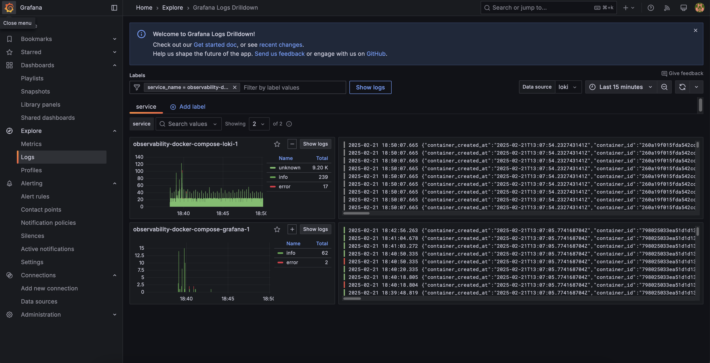
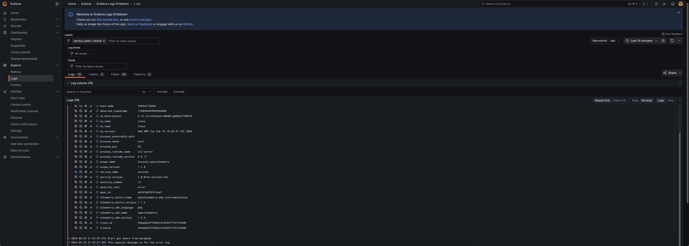
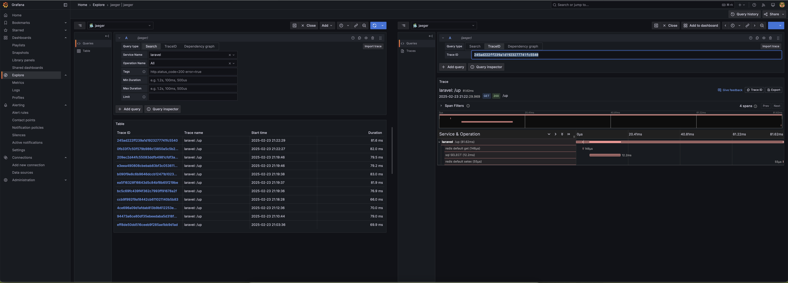
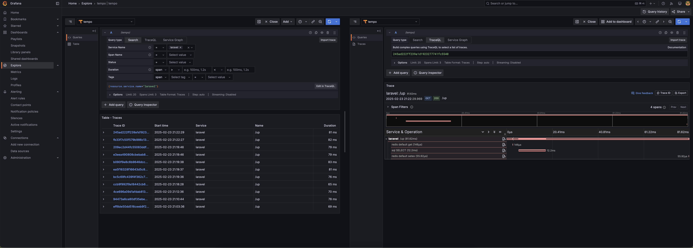
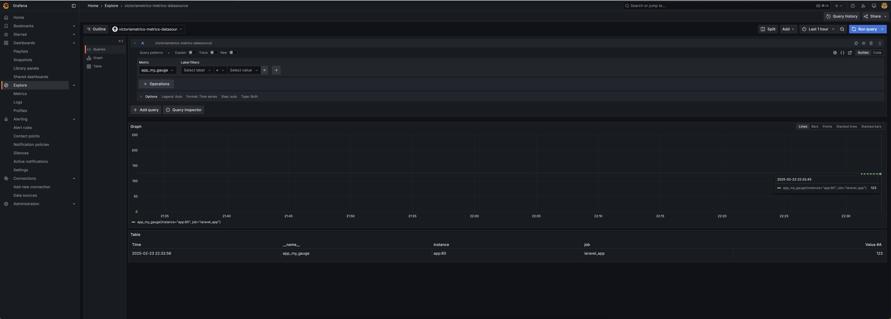
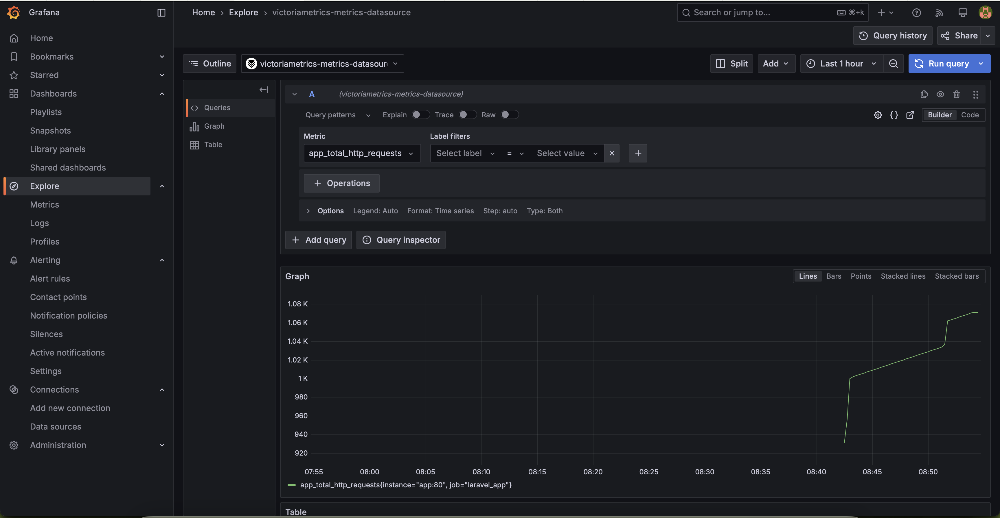

# Как я настроил Observability для своих pet-проектов. Часть 1

Это в какой-то степени продолжение моей статьи — [История создания идеального Docker для Laravel](https://habr.com/ru/articles/883300/). В ней я рассказывал о том, как собрал идеальный Docker-образ для Laravel с Nginx Unit. Это был один из первых шагов по оптимизации моей инфраструктуры. Как я уже упоминал, у меня есть несколько pet-проектов, запущенных на VPS в docker-compose, и я хотел не только отслеживать их состояние, но и прокачать навыки в области Observability.

### Что у меня есть:

- **VPS**, на котором размещены мои проекты. Стандартная конфигурация: 4 ядра, 4 ГБ ОЗУ — и вперёд.
- **Nginx proxy**, который принимает все запросы из интернета. У меня используется сборка с jwilder/nginx-proxy и nginxproxy/acme-companion, которую я выложил в свой GitHub. Благодаря этому я могу добавлять новые проекты на VPS, и они сразу доступны из интернета с SSL-сертификатом от Let’s Encrypt. [Ссылка на репозиторий](https://github.com/nemirlev/nginx-proxy-docker/blob/main/docker-compose.yml).
- **Ghost** для блогов. Это как WordPress на заре его появления, только круче. Написан на Node.js.
- **Laravel** — там, где нужна админка или фронт.
- **Golang** для проектов, где требуется чистый бэкенд.

### Что я хочу видеть:

- **Метрики**, чтобы понимать, какие ресурсы используют мои проекты.
- **Логи**, чтобы иметь представление о том, что происходит внутри контейнеров.
- **Алерты**, чтобы узнавать о проблемах до того, как они станут критичными.
- **Трейсинг**, чтобы отслеживать цепочку вызовов между сервисами и понимать, где именно происходит проблема.

Метрики и логи я буду собирать как с прикладного уровня (сами приложения), так и с инфраструктурных сервисов (Docker, Nginx и т.д.). Также имеет смысл собирать метрики с самой машины, несмотря на то что у провайдера они уже есть, — ведь хочется держать всё в одном месте. Трейсы я пока планирую собирать только базовые, которые предоставляет библиотека OpenTelemetry для фреймворков.

Для самых нетерпеливых — вот [ссылка на репозиторий](https://github.com/nemirlev/observability-pet-projects)

> Сделаю небольшое отступление. Всё, что описано ниже, идеально подходит лично мне, но при этом вы получите базу, которую сможете доработать под свои нужды. Понимаю, что идеала не существует и к нему можно лишь стремиться. Поэтому, если у вас есть идеи, как улучшить — добро пожаловать в комментарии.

## Поднимаем базовые сервисы

Прежде чем что-то собирать, нужно определиться, куда и чем собирать. В качестве инструментов у меня будут:

- **VictoriaMetrics** для метрик. Давно хотел попробовать: это более быстрый и экономичный аналог Prometheus, при этом совместимый с его экосистемой.
- **Jaeger** для трейсинга. Один из самых популярных инструментов для распределённой трассировки.
- **Tempo** для трейсинга. Альтернатива Jaeger с более высокой производительностью.
- **Grafana** для визуализации.
- **Loki** для логов. Более экономичный аналог ELK-стека.
- **Vector** — универсальный агент для сбора всего: им можно собирать даже трейсы (поддерживается OpenTelemetry для логов и метрик). Сейчас считается одним из самых эффективных решений.
- **cAdvisor** для сбора метрик с самой машины.

Хочу отдельно отметить, что у меня два инструмента для трейсинга: Jaeger и Tempo. Так получилось не случайно: Jaeger — это стандарт, поддерживаемый многими инструментами, но он не самый быстрый. Tempo — это альтернатива, которая практически не использует индексы и ориентирована на дешёвое горизонтальное масштабирование. Я привык к Jaeger, но мне захотелось попробовать Tempo. Это pet-проекты, так что риск и накладные расходы невелики.

Приступим к конфигурации с `docker-compose.yaml`.

<spoiler title="docker-compose.yaml">

```yaml
services:
  # Vector for log collection
  vector:
    image: timberio/vector:latest-alpine
    volumes:
      - ./configs/vector/vector.yaml:/etc/vector/vector.yaml:ro
      - /var/run/docker.sock:/var/run/docker.sock:ro
    depends_on:
      - loki
      - victoriametrics
    networks:
      - monitoring

  otel-collector:
    image: otel/opentelemetry-collector:latest
    volumes:
      - ./configs/otel-collector/otel-collector-config.yml:/etc/otel-collector/otel-collector-config.yaml
    command: [ "--config=/etc/otel-collector/otel-collector-config.yaml" ]
    networks:
      - monitoring

  # Tempo for trace visualization
  tempo:
    image: grafana/tempo:latest
    volumes:
      - ./configs/tempo/tempo-config.yaml:/etc/tempo/tempo-config.yaml
    command: [ "--config.file=/etc/tempo/tempo-config.yaml" ]
    restart: unless-stopped
    networks:
      - monitoring

  # Loki for log aggregation
  loki:
    image: grafana/loki:latest
    command: -config.file=/etc/loki/loki-config.yaml
    volumes:
      - ./configs/loki/loki-config.yaml:/etc/loki/loki-config.yaml
      - loki-data:/loki
    networks:
      - monitoring

  # VictoriaMetrics for storing metrics
  victoriametrics:
    image: victoriametrics/victoria-metrics:latest
    volumes:
      - victoriametrics-data:/storage
      - ./configs/victoria/victoriametrics-scrape.yml:/etc/victoria/prometheus.yml:ro
    command:
      - '--retentionPeriod=3'
      - '--promscrape.config=/etc/victoria/prometheus.yml'
    networks:
      - monitoring

  # Grafana for visualization
  grafana:
    image: grafana/grafana:latest
    ports:
      - "3000:3000"
    volumes:
      - grafana-data:/var/lib/grafana
    depends_on:
      - loki
      - victoriametrics
      - jaeger  # Добавляем зависимость от Jaeger
    environment:
      - GF_SECURITY_ADMIN_PASSWORD=admin
      - GF_USERS_ALLOW_SIGN_UP=false
    networks:
      - monitoring

  # Jaeger for distributed tracing
  jaeger:
    image: jaegertracing/all-in-one:latest
    environment:
      - COLLECTOR_ZIPKIN_HOST_PORT=:9411  # Поддержка Zipkin-формата
      - PROMETHEUS_SERVER_URL=http://victoriametrics:8428
    volumes:
      - jaeger-data:/data  # Хранение данных трассировки
    networks:
      - monitoring

  # cAdvisor for container metrics
  cadvisor:
    image: gcr.io/cadvisor/cadvisor:latest
    volumes:
      - /:/rootfs:ro
      - /var/run:/var/run:ro
      - /sys:/sys:ro
      - /var/lib/docker/:/var/lib/docker:ro
      - /dev/disk/:/dev/disk:ro
    networks:
      - monitoring

volumes:
  loki-data:
  victoriametrics-data:
  grafana-data:
  jaeger-data:  # Добавляем volume для Jaeger

networks:
  monitoring:
    external: true
```
</spoiler>

Здесь мы поднимаем все необходимые сервисы. Указываем сеть, с помощью которой будем передавать данные в наши сервисы с других контейнеров (перед запуском надо создать её командой `docker network create monitoring`). Для полноценного запуска потребуются ещё несколько конфигурационных файлов:

<spoiler title="vector.yaml">

```yaml
# ------------------------------------------------------------------------------
# V E C T O R Configuration
# ------------------------------------------------------------------------------
# Website: https://vector.dev
# Docs: https://vector.dev/docs
# Chat: https://chat.vector.dev
# ------------------------------------------------------------------------------

# Источник: логи из Docker
sources:
  docker_logs:
    type: "docker_logs"

# Преобразование: добавляем метку сервиса (опционально)
transforms:
  parse_logs:
    type: "remap"
    inputs:
      - "docker_logs"
    source: |
      .service = "docker"

# Отправка логов в Loki
sinks:
  loki:
    type: "loki"
    inputs:
      - "parse_logs"
    endpoint: "http://loki:3100"
    labels:
      app: "{{ container_name }}"
    encoding:
      codec: "json"
```

</spoiler>

Данный конфиг сообщает Vector, что необходимо читать логи всех контейнеров (через `docker_logs`) и пересылать их в Loki.

<spoiler title="loki-config.yaml">

```yaml
auth_enabled: false

server:
  http_listen_port: 3100
  grpc_listen_port: 9096
  log_level: debug
  grpc_server_max_concurrent_streams: 1000

common:
  instance_addr: 127.0.0.1
  path_prefix: /tmp/loki
  storage:
    filesystem:
      chunks_directory: /tmp/loki/chunks
      rules_directory: /tmp/loki/rules
  replication_factor: 1
  ring:
    kvstore:
      store: inmemory

query_range:
  results_cache:
    cache:
      embedded_cache:
        enabled: true
        max_size_mb: 100

limits_config:
  metric_aggregation_enabled: true

schema_config:
  configs:
    - from: 2020-10-24
      store: tsdb
      object_store: filesystem
      schema: v13
      index:
        prefix: index_
        period: 24h

pattern_ingester:
  enabled: true
  metric_aggregation:
    loki_address: localhost:3100

ruler:
  alertmanager_url: http://localhost:9093

frontend:
  encoding: protobuf
```

</spoiler>

Это базовый конфиг для Loki, который можно со временем доработать.

<spoiler title="tempo-config.yaml">

```yaml
#stream_over_http_enabled: true
server:
  http_listen_port: 3200  # Порт веб-интерфейса Tempo
  grpc_listen_port: 9095  # OTLP gRPC-эндпоинт для трейсов

distributor:
  receivers:
    otlp:
      protocols:
        grpc:
          endpoint: "0.0.0.0:4317"  # должен совпадать с OTEL Collector
        http:
          endpoint: "0.0.0.0:4318"  # тоже должен совпадать с OTEL Collector

query_frontend:
  search:
    duration_slo: 5s
    throughput_bytes_slo: 1.073741824e+09
    metadata_slo:
      duration_slo: 5s
      throughput_bytes_slo: 1.073741824e+09
  trace_by_id:
    duration_slo: 5s

ingester:
  max_block_duration: 5m

compactor:
  compaction:
    block_retention: 48h  # хранить трейсы 48 часов

storage:
  trace:
    backend: local
    wal:
      path: /var/tempo/wal
    local:
      path: /var/tempo/blocks

metrics_generator:
  registry:
    external_labels:
      source: tempo
      cluster: docker-compose
  storage:
    path: /var/tempo/generator/wal
    remote_write:
      - url: http://victoriametrics:9090/api/v1/write
        send_exemplars: true
  traces_storage:
    path: /var/tempo/generator/traces

overrides:
  defaults:
    metrics_generator:
      processors: [ service-graphs, span-metrics, local-blocks ]
      generate_native_histograms: both
```

</spoiler>

Настройки для Tempo.

<spoiler title="otel-collector-config.yml">

```yaml
extensions:
  health_check:

receivers:
  otlp:
    protocols:
      grpc:
        endpoint: "0.0.0.0:4317"
      http:
        endpoint: "0.0.0.0:4318"

processors:
  batch:
    timeout: 5s
    send_batch_size: 1024
  memory_limiter:
    check_interval: 5s
    limit_mib: 512
    spike_limit_mib: 128

exporters:
  prometheus:
    endpoint: "0.0.0.0:8889"  # Эндпоинт для Prometheus
  otlp:
    endpoint: "tempo:4317"  # Путь в Tempo
    tls:
      insecure: true
  otlp/jaeger:
    endpoint: "jaeger:4317"
    tls:
      insecure: true
  otlphttp/logs:
    endpoint: "http://loki:3100/otlp"
    tls:
      insecure: true
  debug:  # Отладочный экспортер (необязательно)

service:
  extensions: [ health_check ]

  pipelines:
    metrics:
      receivers: [ otlp ]
      processors: [ batch ]
      exporters: [ prometheus, debug ]  # Отправляем метрики в Prometheus
    traces:
      receivers: [ otlp ]
      processors: [ batch, memory_limiter ]
      exporters: [ otlp, otlp/jaeger, debug ]  # Отправляем трейсы в Tempo и Jaeger
    logs:
      receivers: [ otlp ]
      processors: [ batch ]
      exporters: [ otlphttp/logs, debug ]  # Логи отправляются в Loki
```
</spoiler>

<spoiler title="victoriametrics-scrape.yml">

```yaml
global:
  scrape_interval: 15s

scrape_configs:
  - job_name: 'otel-collector'
    scrape_interval: 5s
    metrics_path: '/metrics'
    static_configs:
      - targets:
          - 'otel-collector:8889'

  - job_name: 'containeradvisor'
    scrape_interval: 5s
    static_configs:
      - targets: [ 'cadvisor:8080' ]
```
</spoiler>

Благодаря этому конфигу мы собираем метрики с cAdvisor и OpenTelemetry Collector.

После того как все файлы готовы, можно запустить сервисы:

```bash
docker compose up -d
```

Затем заходим в Grafana (логин/пароль — `admin/admin`), которая потребует сменить пароль. Источники для большинства сервисов добавятся автоматически, кроме источника для VictoriaMetrics. Для его добавления зайдите в **Connections -> Add new connection -> VictoriaMetrics**, нажмите **Add new data source** и в поле `URL` укажите `http://victoriametrics:8428`.

> Примечание: я пока не до конца разобрался, чем отличается VictoriaMetrics от Prometheus (в контексте Grafana) при работе с Prometheus-метриками. Судя по всему, если указать плагин Prometheus, то Grafana корректно подключается к VictoriaMetrics. Но, тем не менее, я предпочитаю явно указать её как отдельный источник.



Можно также установить готовый дашборд для cAdvisor, который показывает метрики контейнеров. Для этого в Grafana перейдите в **Dashboards -> New -> Import** и введите ID — `15798`.

## Настройка доступа к WebUI

Сервисы запущены, всё отлично, если это происходит локально. Но мы хотим иметь Observability и на VPS, а, скорее всего, у вас там открыты только порты 80 и 443 (ну и SSH, причём на нестандартном порту, да ещё и с ключами).

Есть два подхода:
1. Настроить Nginx. Благодаря `nginx-proxy` достаточно указать переменные в конфиге, и это довольно удобно, хотя с точки зрения безопасности — не самый надёжный вариант. Но, если у вас есть бэкапы и никакой критичности, можно.
2. Настроить доступ через SSH-туннель. Чтобы не вводить команду каждый раз, можно добавить алиас. Например, в `~/.bashrc` или `~/.zshrc`:

```bash
alias obs='ssh -L 3000:localhost:3000 user@your-vps'
```

Тогда, набрав `obs`, вы создадите туннель на `localhost:3000`, и сможете зайти на Grafana, как будто она локально. 

В этой статье я не буду подробно описывать настройки доступа, сертификаты и т.д. — тема большая. Если интерес есть, то могу сделать отдельный материал.

## Настройка проекта Laravel

Давайте настроим приложение. Цель: собирать логи, трейсы и метрики. При этом логика и метрики с инфраструктурных сервисов уже есть. Как сделать это оптимально?

Инфраструктурные логи собираются автоматически благодаря Vector (все логи Nginx Unit отправляются в Loki). Логи приложения также можно собирать таким образом, но без дополнительной информации вроде traceId логи могут оказаться "безликими". 

Поэтому для логов и трейсинга мы будем использовать OpenTelemetry, но не "чистую" (хотя есть официальная SDK для PHP), а библиотеку [keepsuit/laravel-opentelemetry](https://github.com/keepsuit/laravel-opentelemetry). А для метрик — [spatie/laravel-prometheus](https://github.com/spatie/laravel-prometheus).

> Я буду указывать только то, что нужно изменить в уже работающем проекте, чтобы не перегружать статью. Полный код можно посмотреть по ссылке в начале.

### Шаг 1. Подключаемся к сети `monitoring`

В нашем `docker-compose.yaml` для Laravel-приложения нужно добавить:

```yaml
networks:
  - monitoring
```

И объявить:

```yaml
networks:
  monitoring:
    external: true
```

### Шаг 2. Устанавливаем зависимости

В Dockerfile добавим:

```bash
pecl install opentelemetry grpc
```

Затем установим нужные пакеты для трейсинга и логов:

```bash
composer require laraotel/opentelemetry-laravel
composer require open-telemetry/transport-grpc
```

> Важно: на PHP 8.4 у меня не заработало, выбрасывало ошибки и логи не приходили. На 8.3 всё идёт гладко.

Далее опубликуем конфигурацию:

```bash
php artisan vendor:publish --provider="Keepsuit\\LaravelOpenTelemetry\\LaravelOpenTelemetryServiceProvider" --tag="opentelemetry-config"
```

### Шаг 3. Настраиваем логи в `config/logging.php`

```php
'otlp' => [
    'driver' => 'monolog',
    'handler' => \Keepsuit\LaravelOpenTelemetry\Support\OpenTelemetryMonologHandler::class,
    'level' => 'debug',
]
```

И прописываем переменные в `.env`:

```dotenv
OTEL_EXPORTER_OTLP_ENDPOINT="http://otel-collector:4317"
OTEL_EXPORTER_OTLP_PROTOCOL=grpc
LOG_CHANNEL=otlp
```

Чтобы проверить, создадим маршрут `up` в `web.php`:

```php
Route::get('/up', function () {
    Log::notice("Start get Users from database");
    $user = User::all();
    Log::error("This special message is for the error log");
    return response()->json($user);
});
```

И в `DatabaseSeeder`:

```php
public function run()
{
    User::factory(1000)->create();
}
```

Применяем миграции (`php artisan migrate`) и заливаем тестовые данные (`php artisan db:seed`), после чего заходим на `http://localhost/up`. Смотрим логи в **Grafana -> Explore -> Logs** и выбираем `service = "laravel"`. Видим логи приложения.



Обратите внимание на `traceid`, который одинаков для всех логов в рамках запроса. Это позволит объединить логи и трейсы.

Теперь переходим во вкладку **Explore** и выбираем **Jaeger**. Мы увидим трейс нашего запроса:



Аналогично можем посмотреть в Tempo (трейсы отправляются и туда):



Благодаря библиотеке `keepsuit/laravel-opentelemetry` мы получаем трейсы:
- **Http server requests** — маршруты Laravel
- **Http client** — запросы к другим сервисам
- **Database** — запросы к базе
- **Redis** — операции Redis
- **Queue** — очереди

При необходимости можем расширять логику, добавляя собственные спаны в код.

### Сбор метрик

Для метрик используем [spatie/laravel-prometheus](https://github.com/spatie/laravel-prometheus). В качестве альтернативы можно глянуть [ensi/laravel-prometheus](https://github.com/ensi-platform/laravel-prometheus), но лично мне первая библиотека понравилась больше. Она умеет собирать метрики Horizon (хотя можно и без Horizon).

```bash
composer require spatie/laravel-prometheus
composer require laravel/horizon
```

После этого выполним:

```bash
php artisan prometheus:install
php artisan horizon:install
```

В `PrometheusServiceProvider` раскомментируем строчку:

```php
$this->registerHorizonCollectors();
```

Теперь, зайдя на `http://localhost/prometheus`, увидим метрики, которые собирает библиотека. Для того чтобы VictoriaMetrics подтягивала эти метрики, нужно указать в `victoriametrics-scrape.yml`:

```yaml
- job_name: 'laravel_app'
  scrape_interval: 15s
  metrics_path: '/prometheus'
  static_configs:
    - targets: [ 'app:80' ]
```

> `job_name` лучше давать уникальным и осмысленным, чтобы понимать, откуда эти метрики.

Переходим в **Grafana -> Explore -> VictoriaMetrics** и видим там появившиеся метрики.



Среди дефолтных метрик не так много всего. Например, нет счётчика HTTP-запросов. Но его легко добавить. Создадим middleware:

```bash
php artisan make:middleware RequestMetricsMiddleware
```

```php
<?php

namespace App\Http\Middleware;

use Closure;
use Illuminate\Support\Facades\Cache;

class RequestMetricsMiddleware
{
    public function handle($request, Closure $next)
    {
        $start = microtime(true);

        $response = $next($request);

        $duration = microtime(true) - $start;

        Cache::increment('http_requests_total');

        return $response;
    }
}
```

В `bootstrap/app.php` добавим:

```php
->withMiddleware(function (Middleware $middleware) {
    $middleware->append(\App\Http\Middleware\RequestMetricsMiddleware::class);
})
```

И зарегистрируем новый счётчик в `PrometheusServiceProvider`:

```php
Prometheus::addGauge('Total HTTP Requests')
    ->helpText('Number of HTTP requests since the app started')
    ->value(function () {
        return Cache::get('http_requests_total', 0);
    });
```

Теперь на `http://localhost/prometheus` видно, как `http_requests_total` растёт при каждом запросе. И в Grafana мы получим симпатичный график.



## Заключение

Статья получилась объёмной: мы построили базовый стек Observability для наших pet-проектов, подняли сервисы для сбора метрик, логов и трейсов, а также интегрировали их с Laravel. В итоге у нас получилась гибкая и недорогая система для сбора и анализа ключевых данных о работе инфраструктуры — от состояния Docker-контейнеров до внутренних событий приложения. Это упростит отладку и диагностику инцидентов, а также позволит собирать важную статистику для дальнейшего развития проектов.

Однако на этом всё не заканчивается: нам ещё предстоит настроить метрики для Redis, Nginx Unit, PostgreSQL, MariaDB, а также интегрировать приложения на Golang и Node.js (Ghost). Об этом я расскажу в следующих частях, вторую часть планирую выпустить примерно через неделю.

_Если остались вопросы или хотите обсудить тему подробнее — пишите в комментариях и подписывайтесь на мой [канал в Telegram](https://t.me/bodrcoder)._