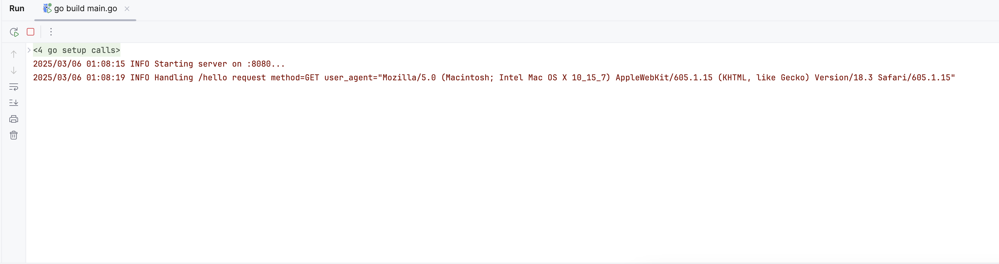
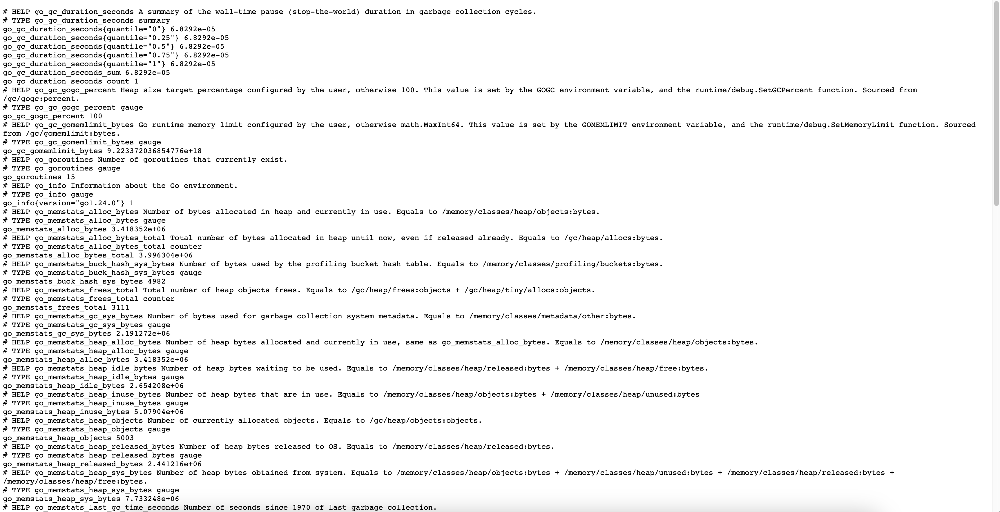
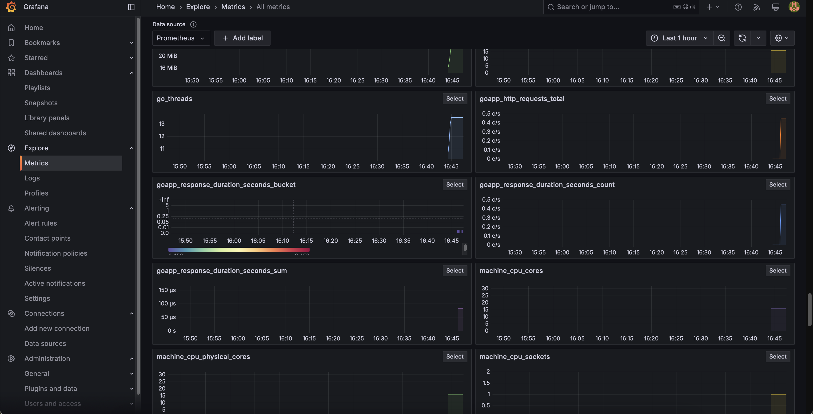
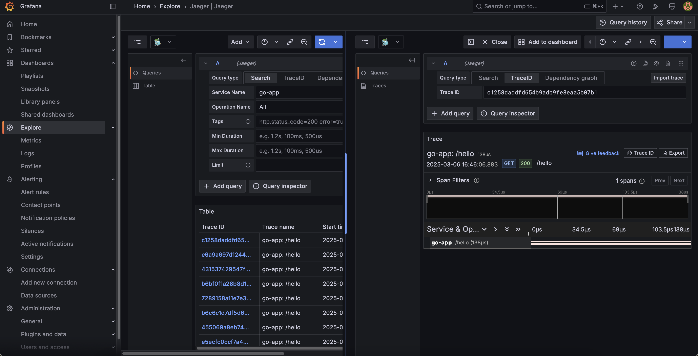
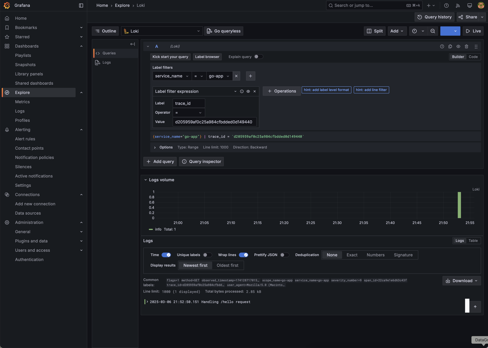

# Как я настроил Observability для своих pet-проектов. Часть 2

В первой части мы развернули базовый стек для сбора метрик, логов и трейсов и интегрировали его с приложением на
Laravel. Теперь покажу настройку Observability на примере простого Golang-приложения — настроим в нём структурированные
логи, распределённый трейсинг и метрики, а также интегрируем с нашим стеком.

> Для нетерпеливых, по традиции можете сразу
> посмотреть [репозиторий с примером](https://github.com/nemirlev/observability-pet-projects)
> Запускаете `docker-compose up` в корне и `docker compose up` в `./examaples/golang`, переходите на
`http://localhost:3000` и пару раз обновляете страницу `http://localhost:8080/hello` что бы сгенерировать нагрузку.

## Создаем простой сервис

Начнём с создания минимального HTTP-сервиса на Go, который будем использовать для тестирования логирования и
трассировки. Напишем небольшое веб-приложение: оно будет слушать HTTP-порт и обрабатывать один-два маршрута. Например,
сделаем эндпоинт `/hello`, возвращающий простое сообщение. Создадим файл `main.go` со следующим содержанием:

```go
package main

import (
	"fmt"
	"log"
	"net/http"
)

func helloHandler(w http.ResponseWriter, r *http.Request) {
	fmt.Fprintln(w, "Hello, Observability!")
}

func main() {
	http.HandleFunc("/hello", helloHandler)
	log.Println("Starting server on :8080...")
	err := http.ListenAndServe(":8080", nil)
	if err != nil {
		log.Fatalf("Server failed: %s", err)
	}
}
```

Этот код запускает HTTP-сервер на порту 8080 и регистрирует обработчик `helloHandler` на путь `/hello`. Функция просто
пишет
текстовый ответ клиенту. Логи мы пока выводим через стандартный `log.Println` – этого достаточно, чтобы убедиться, что
сервис работает. Запустив приложение, можно проверить в браузере или с помощью curl http://localhost:8080/hello, что оно
возвращает “Hello, Observability!”. Теперь усложним его, добавляя необходимые для Observability инструменты.

## Структурированные логи

Вместо использования стандартного логера, перейдем на slog – библиотеку для структурированного логирования,
появившуюся в поставке Go 1.21. Она позволяет удобно добавлять к сообщениям поля (ключ-значение) и лучше
подходит для последующей отправки логов в системы мониторинга. Чтобы интегрировать slog с нашим Observability-стеком,
воспользуемся OpenTelemetry для slog (otelslog). Он перехватывает сообщения slog и обогащает их данными о
трассировке (например, trace_id), позволяя коррелировать логи с запросами. Кроме того, через otelslog мы будем
отправлять логи напрямую в OpenTelemetry Collector по протоколу OTLP, минуя Vector.

Сначала добавим нужные зависимости OpenTelemetry в проект:

```bash
go get go.opentelemetry.io/otel/exporters/otlp/otlplog/otlploggrpc \
      go.opentelemetry.io/otel/sdk/log \
      go.opentelemetry.io/otel/log/global \
      go.opentelemetry.io/contrib/bridges/otelslog
```

Затем настроим провайдер логов в коде. Для простоты сразу укажем адрес OTEL Collector и отключим TLS (так как Collector
слушает без шифрования внутри Docker-сети):

```go
package main

import (
	"go.opentelemetry.io/contrib/bridges/otelslog"
	"go.opentelemetry.io/otel/exporters/otlp/otlplog/otlploggrpc"
	"go.opentelemetry.io/otel/log/global"
	"go.opentelemetry.io/otel/sdk/log"
)

func initLogger(ctx context.Context) func() {
	logExporter, err := otlploggrpc.New(ctx, otlploggrpc.WithEndpoint("otel-collector:4317"), otlploggrpc.WithInsecure())
	if err != nil {
		panic(fmt.Sprintf("failed to initialize OTLP log exporter: %v", err))
	}

	res, err := resource.New(ctx,
		resource.WithAttributes(semconv.ServiceNameKey.String("go-app")),
	)
	if err != nil {
		panic(fmt.Sprintf("resource creation error: %v", err))
	}

	lp := log.NewLoggerProvider(
		log.WithResource(res),
		log.WithProcessor(log.NewBatchProcessor(logExporter)),
	)

	global.SetLoggerProvider(lp)

	slog.SetDefault(otelslog.NewLogger("go-app"))

	return func() {
		if err := lp.Shutdown(ctx); err != nil {
			panic(fmt.Sprintf("failed to shutdown logger provider: %v", err))
		}
	}
}
```

С помощью этой функции мы настраиваем экспорт структурированных логов в OpenTelemetry Collector по протоколу OTLP. После
этого создаём `LoggerProvider` с батч-обработчиком и регистрируем его глобально. Последняя строка заменяет логгер по
умолчанию на `otelslog.NewLogger("go-app")` – это автоматически добавит в каждый лог поле service name и данные
трассировки
(trace_id/span_id). В конце функции возвращаем `lp.Shutdown`, чтобы корректно завершить работу приложения.

Теперь используем новый логгер в наших обработчиках. Например, расширим функцию helloHandler, чтобы она записывала
структурированный лог при каждом запросе:

```go
package main

func helloHandler(w http.ResponseWriter, r *http.Request) {
	ctx := r.Context()
	slog.InfoContext(ctx, "Handling /hello request",
		"method", r.Method,
		"user_agent", r.UserAgent())
	_, err := fmt.Fprintln(w, "Hello, Observability!")
	if err != nil {
		slog.Error("Failed to write response", "error", err)
		return
	}
}
```

Здесь мы вызываем `slog.InfoContext`, передавая контекст запроса и несколько полей: метод HTTP-запроса и User-Agent
клиента. Можем запустить наше приложение и перейти по адресу http://localhost:8080/hello, чтобы увидеть, что логи теперь
структурированы и содержат дополнительные данные.



Но как вы можете заметить, логи не содержат информации о trace_id и отправка их в OpenTelemetry Collector не происходит.
Мы пока не собрали нужный контейнер который будет связан с нашим приложением, а так же не настроили трейсинг. Давайте
перейдем к этому.

## Распределённый трейсинг

Подключим OpenTelemetry для сбора трейсов нашего Go-сервиса. С помощью OpenTelemetry Go SDK мы создадим
`TracerProvider` и настроим экспорт трейсов в OTEL Collector, откуда они попадут в Jaeger и Tempo. Также инструментируем
HTTP-сервер, чтобы каждый входящий запрос порождал span (трейс) с необходимыми атрибутами.

Добавим зависимости для трейсинга:

```bash
go get go.opentelemetry.io/otel/sdk/trace \
      go.opentelemetry.io/otel/trace \
      go.opentelemetry.io/otel/exporters/otlp/otlptrace/otlptracegrpc \
      go.opentelemetry.io/contrib/instrumentation/net/http/otelhttp \
      go.opentelemetry.io/otel/sdk/resource \
      go.opentelemetry.io/otel/semconv/v1.30.0
```

Настроим глобальный TracerProvider в коде, аналогично тому, как делали для логов:

```go
package main

import (
	"context"
	"os"

	"go.opentelemetry.io/contrib/bridges/otelslog"
	"go.opentelemetry.io/otel"
	"go.opentelemetry.io/otel/exporters/otlp/otlplog/otlploggrpc"
	"go.opentelemetry.io/otel/exporters/otlp/otlptrace/otlptracegrpc"
	"go.opentelemetry.io/otel/log/global"
	"go.opentelemetry.io/otel/sdk/log"
	"go.opentelemetry.io/otel/sdk/resource"
	sdktrace "go.opentelemetry.io/otel/sdk/trace"
	semconv "go.opentelemetry.io/otel/semconv/v1.30.0"
)

func initTracer(ctx context.Context) func() {
	exp, err := otlptracegrpc.New(ctx,
		otlptracegrpc.WithEndpoint("otel-collector:4317"),
		otlptracegrpc.WithInsecure())
	if err != nil {
		panic("failed to create trace exporter: " + err.Error())
	}

	res, err := resource.New(ctx,
		resource.WithAttributes(semconv.ServiceNameKey.String("go-app")))
	if err != nil {
		panic(fmt.Sprintf("resource creation error: %v", err))
	}

	tp := sdktrace.NewTracerProvider(
		sdktrace.WithBatcher(exp,
			sdktrace.WithMaxExportBatchSize(512),
			sdktrace.WithBatchTimeout(5*time.Second)),
		sdktrace.WithResource(res),
	)

	otel.SetTracerProvider(tp)

	return func() {
		_ = tp.Shutdown(context.Background())
	}
}
```

В этой функции аналогично создается OTLP экспортер, и `TracerProvider` с ресурсом. Это имя сервиса потом позволит
фильтровать
трейсы в Jaeger/Tempo. Функция возвращает `tp.Shutdown`, которая позволяет корректно завершить работу при выходе из
приложения.

Далее, инструментируем HTTP-сервер. Пакет `otelhttp` из opentelemetry-go-contrib - это middleware для стандартного
net/http, который автоматически создаёт span для каждого входящего запроса. Им воспользуемся при настройке маршрутов.
Вместо прямого вызова `http.HandleFunc`, обернём наш обработчик:

```go
mux := http.NewServeMux()
mux.Handle("/hello", otelhttp.NewHandler(http.HandlerFunc(helloHandler), "/hello"))
```

Благодаря `otelhttp.NewHandler`, при каждом запросе к `/hello` будет создаваться новый span с именем "/hello" (можно
указывать другое имя операции вторым параметром). В контексте, который получит helloHandler, уже будет установлен
активный span – поэтому, вызывая `slog.InfoContext(ctx, ...)`, мы автоматически привяжем лог к ID этого спана. При
желании, мы можем добавить вложенные спаны внутри обработчиков для более детализированной трассировки. Например, можно
искусственно создать дополнительный span вокруг какой-то логики:

```go
package main

func helloHandler(w http.ResponseWriter, r *http.Request) {
	ctx := r.Context()
	// Создаём новый span вокруг обработки запроса
	_, span := otel.Tracer("go-app").Start(ctx, "businessLogic")
	defer span.End()

	// ... Бизнес логика ...

	// Логируем результат
	slog.InfoContext(ctx, "Handled /hello request", "method", r.Method)
	fmt.Fprintln(w, "Hello, Observability!")
}
```

Здесь мы получаем глобальный трейсер и начинаем новый спан "businessLogic". В реальном приложении, думаю понятно
что может быть размещено вместо комментария. Для примера мы просто сразу завершаем спан. Лог по-прежнему пишется с ctx
запроса (обратите внимание, мы используем исходный ctx, а не тот, что вернул `Tracer.Start`, чтобы привязка лога
осталась к родительскому span). В итоге в Jaeger/Tempo мы увидим, что внутри основного HTTP-запроса есть вложенный шаг
"businessLogic". Остаётся инициализировать всё при старте сервера. В функции main перед ListenAndServe добавим вызовы
наших инициализаторов:

```go
package main

func main() {
	ctx := context.Background()
	shutdownTracer := initTracer(ctx)
	defer shutdownTracer()

	shutdownLogger := initLogger(ctx)
	defer shutdownLogger()

	mux := http.NewServeMux()
	mux.Handle("/hello", otelhttp.NewHandler(http.HandlerFunc(helloHandler), "/hello"))

	srv := &http.Server{Addr: ":8080", Handler: mux}
	fmt.Printf("Starting server on :8080...")
	if err := srv.ListenAndServe(); err != nil {
		slog.Error("Failed to start server", "error", err)
		os.Exit(1)
	}
}
```

Теперь наше приложение будет отправлять трейсы и логи которые содержат trace_is в OpenTelemetry Collector, а оттуда они
попадут в Jaeger, Tempo и Loki.

> Важно отметить, что поддержка логов в OpenTelemetry Go пока экспериментальная. Если нужно стабильности,
> то можно легко по аналогии собирать логи через Vector. А теперь займемся метриками.

## Метрики

Для сбора метрик мы воспользуемся стандартной библиотекой client_golang от Prometheus. Она позволит нам
публиковать метрики в формате, который затем соберёт VictoriaMetrics. В отличие от трейсов и логов, метрики мы не будем
отправлять через OTEL Collector, а просто организуем эндпоинт `/metrics` и настроим сбор метрик.

Добавим клиент Prometheus в зависимости:

```go
go get github.com/prometheus/client_golang/prometheus \
github.com/prometheus/client_golang/prometheus/promhttp
```

Определим несколько метрик. Для примера введём счетчик HTTP-запросов и гистограмму для времени ответа. Их можно
определить как глобальные переменные и регистрировать при инициализации:

```go
package main

import "github.com/prometheus/client_golang/prometheus"

var (
	requestCount = prometheus.NewCounter(prometheus.CounterOpts{
		Name: "goapp_http_requests_total",
		Help: "Total number of HTTP requests handled by the Go app",
	})
	responseDuration = prometheus.NewHistogram(prometheus.HistogramOpts{
		Name:    "goapp_response_duration_seconds",
		Help:    "Histogram of response durations for /hello",
		Buckets: prometheus.DefBuckets,
	})
)

func init() {
	// Регистрируем метрики в глобальном реестре Prometheus
	prometheus.MustRegister(requestCount, responseDuration)
}
```

Здесь `goapp_http_requests_total` — счётчик запросов, а `goapp_response_duration_seconds` — гистограмма длительности
обработки. Мы используем дефолтные "бакеты" для гистограммы (стандартные интервалы). В `init()` регистрируем их, чтобы
клиентская библиотека знала о них.

Теперь в обработчике обновляем эти метрики:

```go
package main

func helloHandler(w http.ResponseWriter, r *http.Request) {
	timer := prometheus.NewTimer(responseDuration) // начинаем таймер для гистограммы
	defer timer.ObserveDuration()                  // зафиксируем время по завершении

	// ... (логика, логирование и т.д., как выше) ...

	requestCount.Inc() // увеличиваем счетчик запросов
	_, err := fmt.Fprintln(w, "Hello, Observability!")
	if err != nil {
		slog.Error("Failed to write response", "error", err)
		return
	}
}
```

Мы обернули выполнение запроса с помощью `NewTimer` — он автоматически измерит время выполнения обработчика и запишет в
гистограмму `responseDuration` при выходе. Также каждый запрос инкрементирует счётчик requestCount.

Остается только опубликовать метрики на отдельном эндпоинте. Для этого добавим обработчик `/metrics`:

```go
package main

import "github.com/prometheus/client_golang/prometheus/promhttp"

// ... внутри main() после настройки mux:
mux.Handle("/metrics", promhttp.Handler())
```



Теперь вы можете запустить приложение и перейти на http://localhost:8080/metrics, чтобы увидеть, что метрики успешно
собираются. Так же вы можете видеть метрики, которые идут вместе с библиотекой. Всё, что осталось, — настроить сбор
метрик в VictoriaMetrics.

На стороне VictoriaMetrics нужно добавить новую цель для сбора. В файле victoriametrics-scrape.yml, который мы настроили
в
первой части, пропишем новый job для Go-сервиса, аналогично тому, как делали для Laravel:

```yaml
- job_name: 'go_app'
  scrape_interval: 15s
  static_configs:
    - targets: [ 'go-app:8080' ]
```

Здесь предполагается, что контейнер с нашим Go-приложением имеет имя go-app. VictoriaMetrics будет опрашивать эндпоинт
`go-app:8080/metrics` каждые 15 секунд и сохранять метрики. (Если у вас другой порт или имя сервиса, не забудьте их
указать.)

После обновления конфигурации, перезапустим сервис VictoriaMetrics, чтобы новый job вступил в силу.

```bash
docker compose restart victoriametrics
```

## Контейнер

Наше приложение готово, и метрики/логи/трейсы настроены на отправку. Теперь интегрируем его в существующую
инфраструктуру. Потребуется добавить новый сервис в docker-compose.yaml и подключить его к сети мониторинга. Ну
и подготовить Dockerfile для сборки образа. Начнем с последнего:

```Dockerfile
FROM golang:1.24-alpine AS builder

WORKDIR /build

COPY ./go.mod ./go.sum ./
RUN go mod download

COPY . .

RUN CGO_ENABLED=0 go build -ldflags="-w -s" -o go-app main.go

FROM alpine:latest

RUN apk --no-cache add ca-certificates && \
    addgroup -S appgroup && adduser -S appuser -G appgroup

COPY --from=builder /build/go-app /app/go-app

USER appuser

WORKDIR /app

EXPOSE 8080

ENTRYPOINT ["/app/go-app", "sync", "-d"]
```

Теперь добавим сервис docker-compose:

```yaml
services:
  go-app:
    build: .
    container_name: go-app
    ports:
      - "8080:8080"
    networks:
      - monitoring

networks:
  monitoring:
    external: true
```

Обратите внимание на подключение к сети `monitoring` – благодаря этому наше приложение сможет достучаться до
otel-collector, victoriametrics и других компонентов по именам и сервис будет доступен для них.

Теперь можем запустить наше приложение:

```bash
docker compose up -d --build go-app
```

После запуска, перейдите на http://localhost:8080/hello, чтобы убедиться, что приложение работает и стоит пару раз
обновить страницу, что бы сгенерировать простую нагрузку.
После чего переходим в grafana (сервис которы который мы описали в прошлой статье думаю уже запущен, если не запущен - 
запустите). Перейдите в раздел Metrics и введите запрос `goapp_http_requests_total` - вы увидите график с количеством 
запросов к нашему сервису.



Теперь перейдите в раздел Explore, выберите Jaeger или Tempo в выпадающем списке и выберете сервис `go-app` - вы увидите
трейсы запросов к нашему сервису.



Ну и теперь можно зайти в раздел Logs и посмотреть логи нашего сервиса.



_Если остались вопросы или хотите обсудить тему подробнее — пишите в комментариях и подписывайтесь на
мой [канал в Telegram](https://t.me/bodrcoder). А еще хотелось бы провести не большой опрос:_